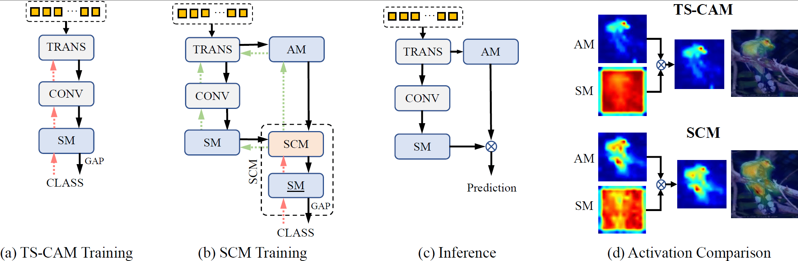
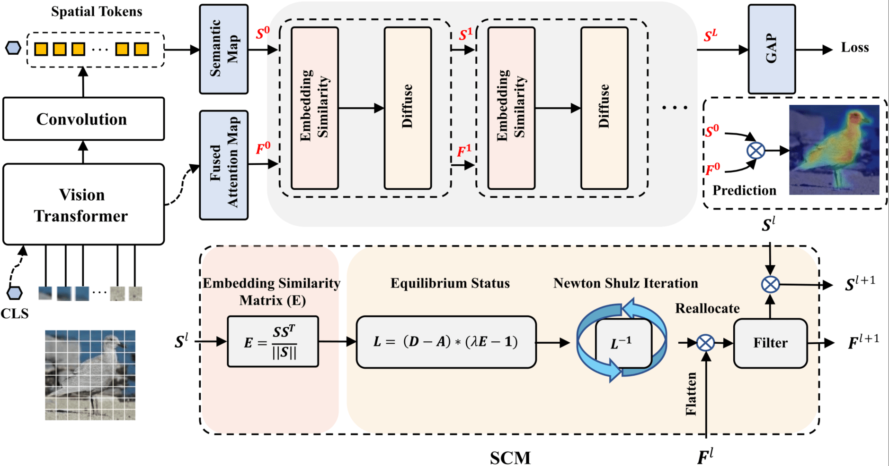
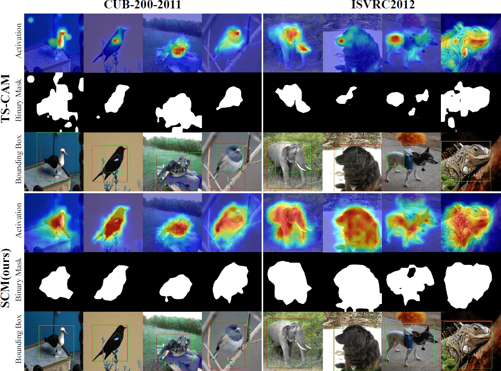

# Weakly Supervised Object Localization via Transformer with Implicit Spatial Calibration
By Haotian Bai, Ruimao Zhang, Jiong Wang, Xiang Wan

## Introduction
Weakly Supervised Object Localization (WSOL), which aims to localize objects by only image-level labels, has attracted much attention because of its low annotation cost in actual application.Recent studies leverage the advantage of self-attention in visual Transformer for long-range dependency to re-active semantic regions, aiming to avoid partial activation in traditional class activation mapping (CAM).
However, the long-range modeling in Transformer neglects the inherent spatial coherence of the object. Usually, it diffuses the semantic-aware regions far from the object boundary, making localization results significantly larger or far smaller. To address such an issue, we introduce a simple yet effective Spatial Calibration Module (SCM) for accurate WSOL, incorporating semantic similarities of patch tokens and their spatial relationships into a unified diffusion model. Specifically, we introduce a learnable parameter to dynamically adjust the semantic correlations and spatial context intensities for effective information propagation. In practice, SCM is designed as an external module of Transformer, and can be removed during inference to reduce the computation cost. The object-sensitive localization ability is implicitly embedded into the Transformer encoder through optimization in the training phase. 
In summary, SCM enables the generated attention maps to capture the sharper object boundaries and filter the object-irrelevant background area. Extensive experimental results demonstrate the effectiveness of the proposed method, which significantly outperforms its counterpart TS-CAM on both CUB-200 and ImageNet-1K benchmarks.

This is othe fficial implementation of ["Weakly Supervised Object Localization via Transformer with Implicit Spatial Calibration"](https://github.com/164140757/SCM) in PyTorch.
Our code is developed based on [TS-CAM](https://github.com/vasgaowei/TS-CAM) and [Wsolevaluation](https://github.com/clovaai/wsolevaluation). Thanks for your code!



## Updates
- [2022-07-17] Initial Commits. Code publically available!


## Architecture Overview

## Results and Models

| Datasets | Backbone | Top1-Loc Acc | Top5-Loc Acc | GT-Known | Top1-Cls Acc | Top5-Cls Acc | Checkpoints & logs|
| :---: | :---: | :---: | :---: | :---: | :---: | :---: | :---: | 
| CUB | Deit-S | 76.4 | 91.6 | 96.6 | 78.5 | 94.5 | [Google Drive](https://drive.google.com/drive/folders/1-FranLy5KSttCPK98ZY27TMXuriE9jkj?usp=sharing) 
| ILSVRC | Deit-S | 56.1 | 66.4 | 68.8 | 76.7 | 93.0 | [Google Drive](https://drive.google.com/drive/folders/1-HZBXo_AoK6W5gwRVh4LD8oyGDYrEc8z?usp=sharing) 

### Visualization


- Note: The image is compressed for efficiency. Please refer to our paper for better visualization rresults
## Usage

### Installation
```
conda env create -f environment.yml
conda activate SCM
```
### Dataset
To prepare the datasets, you can download CUB and ISVRC from the links below. 
```
CUB: https://www.vision.caltech.edu/datasets/cub_200_2011/
ISVRC: https://www.image-net.org/challenges/LSVRC/2012/
```

Then the absolute paths should be specified in the following config file paths.
```
.
├── CUB
│ ├── conformer_scm_small_patch16_224.yaml
│ ├── deit_scm_base_patch16_224.yaml
│ ├── deit_scm_small_patch16_224.yaml
│ ├── deit_tscam_base_patch16_224.yaml
│ ├── deit_tscam_small_patch16_224.yaml
│ ├── deit_tscam_tiny_patch16_224.yaml
│ └── vit_scm_small_patch16_224.yaml
└── ILSVRC
 ├── conformer_tscam_small_patch16_224.yaml
 ├── deit_scm_base_patch16_224.yaml
 ├── deit_scm_small_patch16_224.yaml
 ├── deit_tscam_base_patch16_224.yaml
 ├── deit_tscam_small_patch16_224.yaml
 └── deit_tscam_tiny_patch16_224.yaml
```

For instance in CUB/deit_scm_small_patch16_224.yaml:
```
DATA:
 DATASET: CUB
 DATADIR: /root/Datasets/CUB_200_2011

TRAIN:
 BATCH_SIZE: 256

TEST:
 BATCH_SIZE: 256
```
You could change the DATADIR for the absolute path of the dataset or the BATCH_SIZE depending on your memory.

### Traing
Please use the commands below to launch SCM. Replace {config_file} with the config file path you set up and learning rate {lr}.
```
python tools_cam/test_cam.py --config_file {config_file} --lr {lr}
```
```
# CUB
python tools_cam/train_cam.py --config_file ./configs/CUB/deit_scm_small_patch16_224.yaml --lr 5e-5
# ILSVRC
python tools_cam/train_cam.py --config_file ./configs/ILSVRC/deit_scm_small_patch16_224.yaml --lr 1e-6
```
Since only CUBV2 dataset is available for [MaxboxAcc](https://github.com/clovaai/wsolevaluation).
We provide the default False option at tools_cam/train_cam.py
```
CUBV2=False
```
You can test MaxboxAcc when setting it to True.

### Testing
Specify the path of .pth file for testing and visualization. 
```
# CUB
python tools_cam/test_cam.py --config_file ./configs/CUB/deit_scm_small_patch16_224.yaml --resume ${pth_file_path}
# ILSVRC
python tools_cam/test_cam.py --config_file ./configs/ILSVRC/deit_scm_small_patch16_224.yaml --resume ${pth_file_path}
```
Set up testing at tools_cam/test_cam.py
```
DRAW = False
# VALIDATE_SET = False
topk = (1,5)
cam_curve_interval=.01
multi_contour_eval=False
iou_threshold_list=[30, 50, 70]
metrics = ["maxbox_acc", "GT-Known", "loc_acc", "cls_acc"]
```

1. DRAW means whether to draw the visualization result.
2. cam_curve_interval, mutli_contour_eval, and iou_threshold_list are used to search for optimal threshold values.
For details, please refer to [Wsolevaluation](https://github.com/clovaai/wsolevaluation).
3. metrics denote the measures for evaluation. 

### Drop out SCM
SCM is automatically dropped out during inference by design. 
```
# lib/models/deit.py
if self.training:
    for i, layer in enumerate(self.layers):
        x_patch, cam = layer(x_patch, cam)
        x_logits = self.avgpool(x_patch).squeeze(3).squeeze(2)
    return x_logits
else:
    # drop SCM 
    if self.layers is not None:
        del self.layers 
    x_logits = self.avgpool(pred_semantic).squeeze(3).squeeze(2)
    predict = pred_cam*pred_semantic
    if test_select!=0 and test_select>0:
        topk_ind = torch.topk(x_logits, test_select)[-1]
        predict = torch.tensor([torch.take(a, idx, axis=0) for (a, idx) 
        in zip(cams, topk_ind)])
    return x_logits, predict
```

### Resume Training
Add the ${pth_file_path} to continue the training if needed.
```
 --resume ${pth_file_path}
```

### Log 
The logs are organized as 
```
├── Log_2022-xx-xx-xx-xx.txt
├── backup
├── ckpt
│ └── model_best.pth
├── log
│ └── events.out.tfevents.xxx
└── val.txt
```
where the training result is saved as Log_2022-xx-xx-16-20.txt with logs of validation in val.txt.
You can also check the parameters update at events.out.tfevents by tensorboard.
## Core design

The diffusion algorithm is available at
```
lib/models/graphFusion.py
```
which is imported at haotian/SCM/lib/models/deit.py

### Citation
Please consider citing our article.
```
@inproceedings{Bai2022SCM,
 title={Weakly Supervised Object Localization via Transformer with Implicit Spatial Calibration},
 author={Haotian, Bai and Ruimao, Zhang and Jiong, Wang and Xiang, Wan},
 booktitle={Proceedings of the European conference on computer vision (ECCV)},
 year={2022}
 }
```